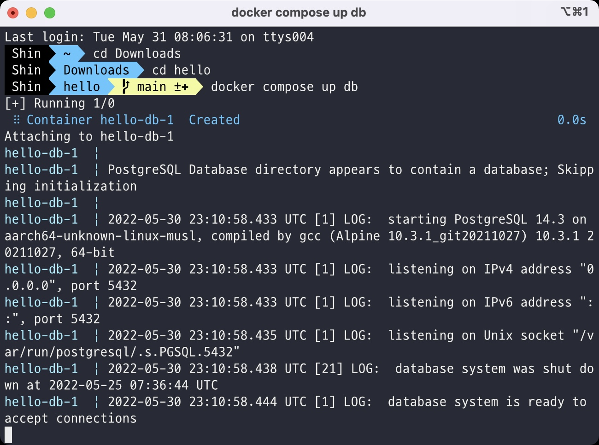
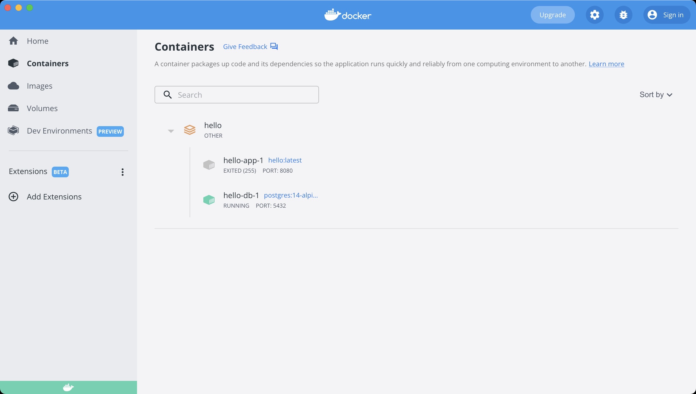
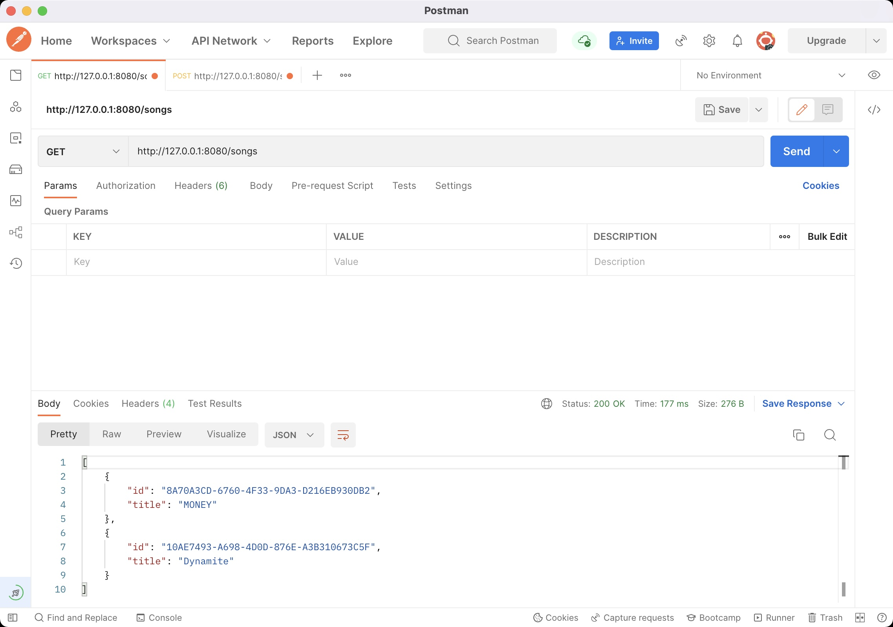
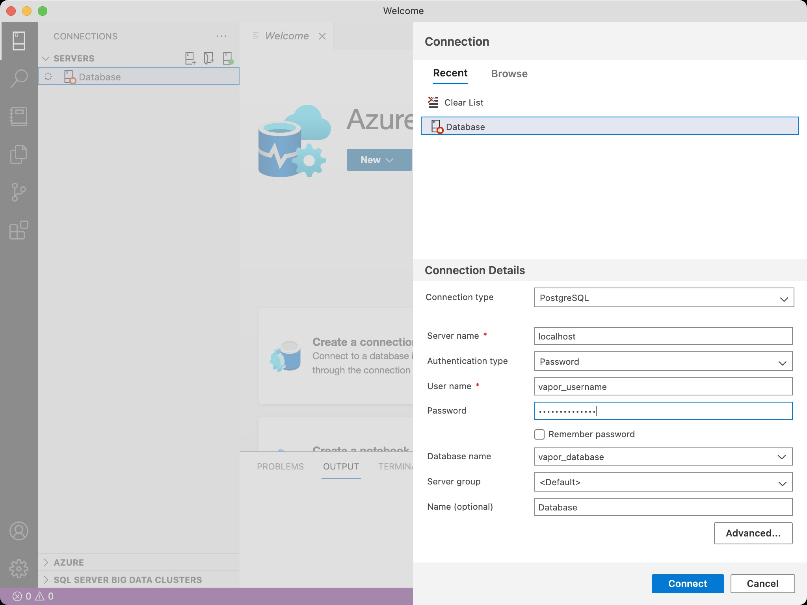
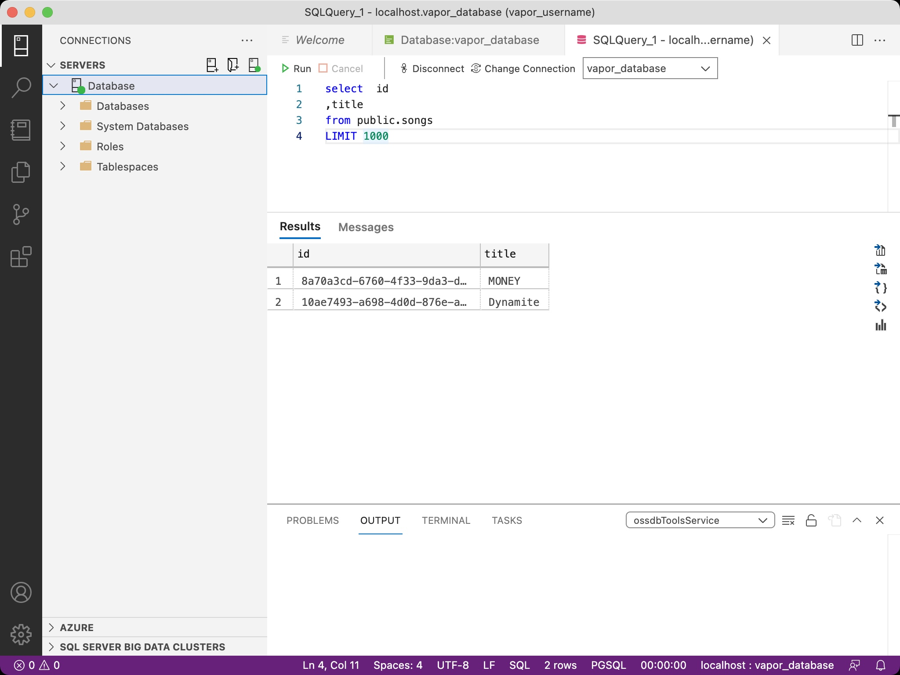
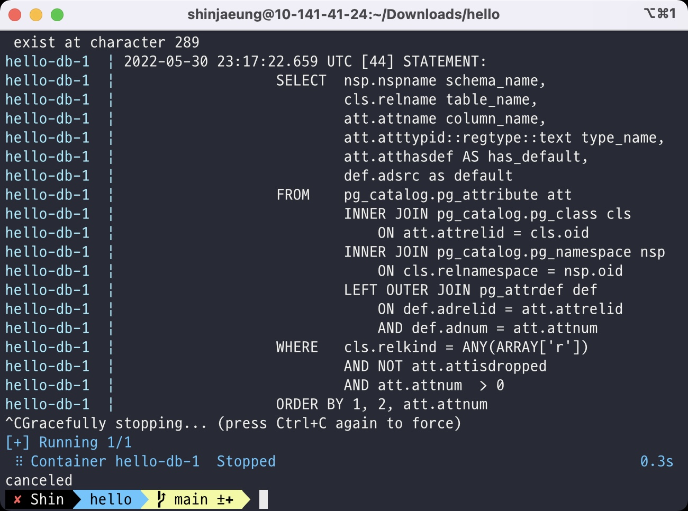

# Vapor 

- Contents
    - [Reference](#Reference)
    - [Delete defaults](#Delete-defaults)
    - [Create New Migration](#Create-New-Migration)
    - [Create New Model](#Create-New-Model)
    - [Create New Controller](#Create-New-Controller)
    - [Update Configure](#Update-Configure)
    - [Update routes](#Update-routes)
    - [Docker](#Docker)
    - [Azure Data Studio](#Azure-Data-Studio)
    - [Stop project](#Stop-project)
    
<br>

## Reference

- [Getting Started with Vapor 4 Lession 2](https://www.youtube.com/watch?v=ae2JBfSFs0A)

<br>

## Delete defaults

- Controller
- Migrations
- Models
- routes.swift
    - ```swift
      try app.register(collection: TodoController())
      ```
- configure.swift
    - ```swift
      app.migrations.add(CreateTodo())
      ```

<br>

## Create New Migration

- Migrations
    - For versioning the database schema
    - Those are used when creating database

- Fluent
    - An ORM(object-relational mapping) framework for Swift
    -  It takes advantage of Swift's strong type system to provide an easy-to-use interface for your database

```swift
import Fluent

struct CreateSongs: Migration {
    // For changes what we want to make
    func prepare(on database: Database) -> EventLoopFuture<Void> {
        return database.schema("songs")
            .id()
            .field("title", .string, .required)
            .create()
    }
    // To revert changes
    func revert(on database: Database) -> EventLoopFuture<Void> {
        return database.schema("songs").delete()
    }
}
```

<br>

## Create New Model

```swift
import Fluent
import Vapor

final class Song: Model, Content {
    static let schema = "songs"
    
    @ID(key: .id)
    var id: UUID?
    
    @Field(key: "title")
    var title: String
    
    init() { }
    
    init(id: UUID? = nil, title: String) {
        self.id = id
        self.title = title
    }
}
```

<br>

## Create New Controller

```swift
import Fluent
import Vapor

struct SongController: RouteCollection {
    
    // first function that runs
    // 127.0.0.1:8080/songs goes to this
    func boot(routes: RoutesBuilder) throws {
        let songs = routes.grouped("songs")
        songs.get(use: index)
        songs.post(use: create)
    }
    
    // /songs route
    func index(req: Request) throws -> EventLoopFuture<[Song]> {
        return Song.query(on: req.db).all()
    }
    
    
    func create(req: Request) throws -> EventLoopFuture<HTTPStatus> {
        let song = try req.content.decode(Song.self)
        return song.save(on: req.db).transform(to: .ok)
    }
}
```

<br>

## Update Configure

- Configure creates database
- It is trying to get an environment variable
- If it can't find out, it will use nil-coalescing

```swift
public func configure(_ app: Application) throws {
    /* ... */
    app.migrations.add(CreateSongs())
    try app.autoMigrate().wait()
    /* ... */
}
```

<br>

## Update routes

```swift
func routes(_ app: Application) throws {
    /* ... */
    try app.register(collection: SongController())
}
```

<br>

## Docker

- Docker compose
    - Start app: docker-compose up db





<br>

## Azure Data Studio

- You can look at the database without using the API
- Extension : Postgras




<br>

## Stop project

- Stop the docker container
    - on terminal, press `ctrl + c`



